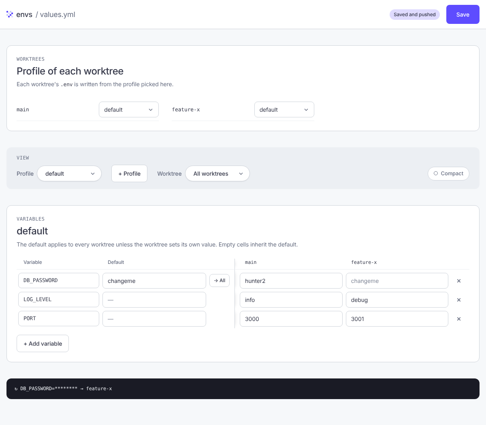

# @jondotsoy/envs

CLI that keeps the `.env` values of every git worktree in a single file (`.envs/values.yml`). Edit all values together and distribute them to each worktree, or collect them from the existing `.env` files.

Requires [Bun](https://bun.com) and git. See [docs/features.md](docs/features.md) for a summary of all features.


## Quick start

Inside your repo (or any of its worktrees), run:

```bash
bunx @jondotsoy/envs edit
```

No install or setup needed. The first time, `edit` creates `.envs/values.yml` and `.envs/.gitignore` (containing `*`, so git ignores the folder), collects the current `.env` of every worktree into `values.yml`, opens it in VS Code (`code -w`) and, when you close the editor, writes the values back to each worktree's `.env`.

To see all commands:

```bash
bunx @jondotsoy/envs help
```

### Global install (optional)

To use the shorter `envs` command, install it globally:

```bash
bun add -g @jondotsoy/envs
```

The examples below use `envs`; without a global install, replace it with `bunx @jondotsoy/envs`.

## Usage

Run the commands inside the repo or any of its worktrees. Inside a worktree, `.envs/` always lives in the main repo.



| Command | What it does |
| --- | --- |
| `envs edit` | Runs `init` if `.envs/values.yml` does not exist yet, then runs `pull`, opens `values.yml` with `code -w` and, when the editor closes, runs `push`. If the editor fails, it does not `push`. |
| `envs edit --ui` | Same `init` and `pull`, but instead of VS Code it starts a local server (`127.0.0.1`, random port) and opens a React web editor with the values of `values.yml` (worktree profiles, defaults and per-worktree values). The **Save** button in the top right corner writes `values.yml` and runs `push`. Stop the server with Ctrl+C. |
| `envs init` | Creates `.envs/`, `.envs/.gitignore` (containing `*`) and an empty `.envs/values.yml`. Does not overwrite existing files. |
| `envs pull` | Reads the `.env` of the main repo and of each worktree and writes it to `values.yml`. Variables that are no longer in a `.env` are removed from `values.yml` for that worktree. |
| `envs push` | Writes `values.yml` to the `.env` of each worktree. Updates existing variables in place, appends new ones at the end, and keeps comments and variables that are not in `values.yml`. |
| `envs use [profile]` | Sets the profile of the current worktree (`uses.<worktree>`) and pushes that worktree. Without arguments it lists the profile of each worktree. The profile must already exist in `values.yml`. |
| `envs lint` | Checks security and prints a warning for each problem. Exits with code 1 if there is any (useful in CI). See below. |
| `envs help` | Shows the help (also `--help`, `-h`, or no command). |

`pull`, `push` and `lint` need `.envs/values.yml` to exist: if it is missing they exit with code 1 and ask you to run `envs init` (or just use `envs edit`, which creates it).

Worktrees are identified by their branch name (or their folder name if they are in detached HEAD). The main repo uses its branch name, for example `main`.

### Output

`envs pull` prints one green line with the pulled branches and the number of variables:

```
↓ pulling main, feature/biz - 3 variables
```

`envs push` prints one yellow line for each variable whose value changes, listing the branches where it changed. Variables that already have the same value are not shown:

```
↻ LOG_LEVEL=info → main, feature/biz
```

Values of sensitive variables (`PASSWORD`, `TOKEN`, `SECRET`, `API_KEY`…, or a `KEY` word such as `KEY_FOO` or `FOO_KEY`) are printed as `********`:

```
↻ DB_PASSWORD=******** → main
```

Colors are disabled when the [`NO_COLOR`](https://no-color.org) environment variable is set to a non-empty value:

```sh
NO_COLOR=1 envs push
```

### `envs lint`

It never prints values, only the variable and its location (`envs.DB_PASSWORD.main`).

| Rule | Detects |
| --- | --- |
| `tracked-values`, `unignored-values` | `values.yml` is tracked by git or is not ignored. |
| `tracked-dotenv`, `unignored-dotenv` | A worktree's `.env` is tracked or is not ignored. |
| `open-permissions` | `values.yml` is readable by other users (use `chmod 600`). |
| `executable-files` | `values.yml` or a `.env` has the execute permission (use `chmod -x`). |
| `writable-files` | `values.yml` or a `.env` is writable by the group or other users (use `chmod go-w`). |
| `weak-secret` | Sensitive variable (`PASSWORD`, `TOKEN`, `SECRET`, `API_KEY`…) that is empty or has a typical value (`changeme`, `admin`…). |
| `shared-secret` | Sensitive variable in `defaults`, which is written to all worktrees using that profile. |
| `unknown-profile` | `uses` names a profile that is not in `profiles`. |
| `secret-pattern` | Value with a known secret format (AWS, GitHub, Slack, `sk-…`, private key). |
| `url-credentials`, `insecure-url` | Remote URL with an embedded password, or using `http://`, `ws://` or `ftp://`. |

## `values.yml` format

```yaml
uses:
  main: local
  feature-x: dev
profiles:
  default:
    defaults:
      LOG_LEVEL: info
    envs:
      PORT:
        main: 3000
        feature-x: 3001
  local:
    defaults:
      DATABASE_URL: postgres://localhost/app
    envs: {}
  dev:
    defaults:
      DATABASE_URL: postgres://dev.internal/app
    envs:
      PORT:
        feature-x: 4001
```

- Every profile is written with both `defaults` and `envs` (empty when it has nothing); a profile is never `null`.
- `profiles.<profile>.defaults`: default value of each variable for the worktrees that use the profile.
- `profiles.<profile>.envs.<VARIABLE>.<worktree>`: value of the variable in that worktree. It overrides the profile's `defaults`.
- `uses.<worktree>`: profile of that worktree. A worktree that is not listed uses `default`; `pull` adds it as `default`.
- Values can be strings, numbers or booleans (`PORT: 3000`, `DEBUG: true`); `push` writes them to the `.env` as text (`PORT=3000`, `DEBUG=true`). `pull` converts `true`/`false` and canonical numbers (`3000`, `0.5`) to booleans and numbers; anything else (`007`, `1e3`) stays a string.

A worktree receives, from lowest to highest precedence: `default` defaults, `default` envs, its profile's defaults, its profile's envs. With the `default` profile only the first two apply.

The `.env` files are the source of truth: `pull` (and `edit`) rewrites `values.yml` from them, keeping only `uses` and `profiles`.

### Creating a profile

Write a profile that does not exist yet in `uses.<worktree>` while running `envs edit`: when you close the editor it is created as a copy of `default` (and the worktree receives it). A profile you add by hand under `profiles`, with values or empty, keeps what you wrote (nothing is copied from `default`) and is completed with an empty `defaults`/`envs` if one is missing. `envs push` and `envs use` do not create profiles: they fail with an unknown profile error. `envs lint` reports it as `unknown-profile`.

### Previous format

Files with `defaults` and `envs` at the root keep working: they are read as `profiles.default.defaults` and `profiles.default.envs`, and the next `envs edit` or `envs pull` rewrites the file in the new format.

The schema (JSON Schema) is at [`schema/values.schema.json`](schema/values.schema.json). It is also published at <https://jondotsoy.github.io/envs/schema.json>. `init`, `pull` and `edit` write this line at the top of `values.yml`, so VS Code validates the file with the YAML extension:

```yaml
# yaml-language-server: $schema=https://jondotsoy.github.io/envs/schema.json
```

## Development

```bash
bun install
bun test              # run the tests
bun test --coverage   # with coverage
bun run build         # generates dist/ (envs.js and package.json)
```

- `src/envs.ts`: command logic. `src/bin/envs.ts`: CLI entry point.
- `test/fixtures/workspace.ts`: `createWorkspace({ main, worktrees, files })` fixture, which creates a temporary git repo with worktrees, each in its own temporary folder.

## Publishing

The **Publish** workflow (Actions → Publish → Run workflow) bumps the version, builds and publishes `dist/` to npm via OIDC (trusted publishing). Inputs:

- `bump`: `major`, `minor`, `patch` or `prerelease`.
- `tag`: npm dist-tag (`latest`, `default`, `alpha` or `demo`). With a tag other than `latest` the version is a prerelease (`0.0.2-alpha.0`).
- `provenance`: publish with provenance. npm only accepts it if the repository is public.

After publishing, it creates the version commit and tag, and a GitHub release linking to the version on npm.

## Security

To report a vulnerability, see [SECURITY.md](SECURITY.md).

## License

[MIT](LICENSE)
